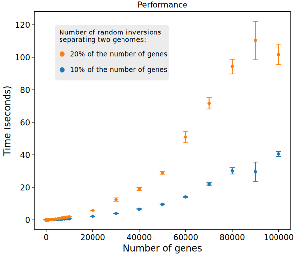
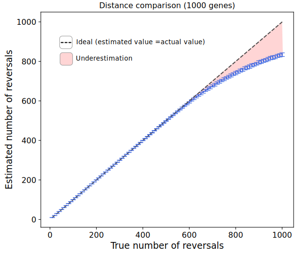
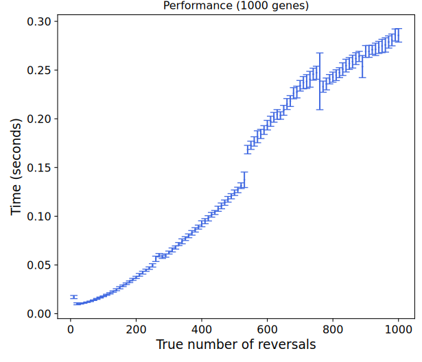
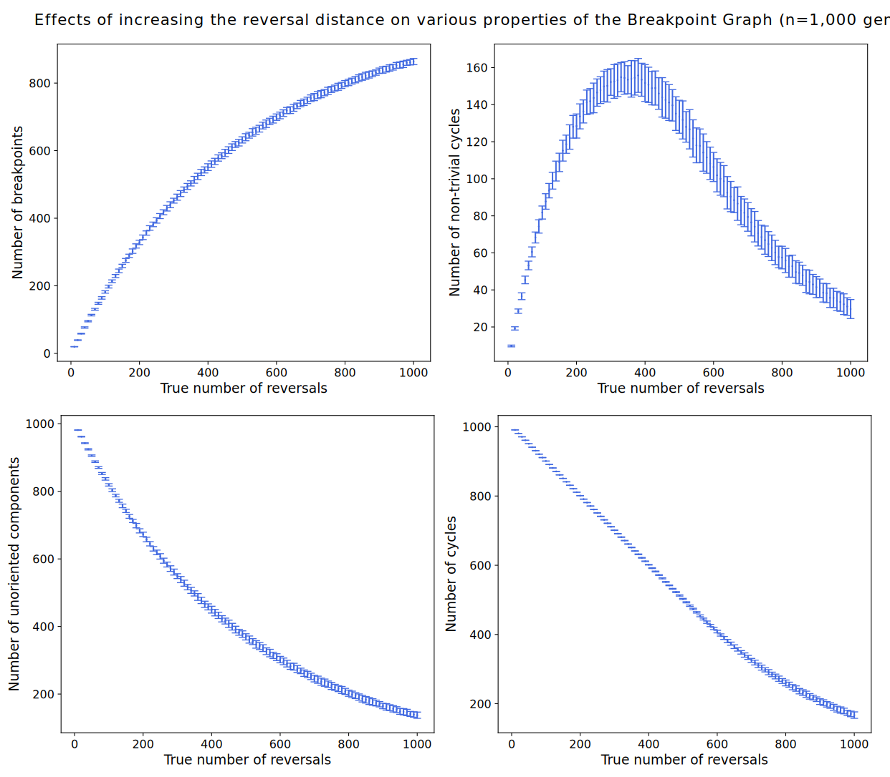

# Sorting by Reversals

## Overview

Given the order and the orientation of a set of genes in two genomes, the program finds an evolutionary path that connects both genomes with the minimum number of inversions. This path consists of a series of inversions that, when applied to one genome, will transform it into the other.

It is expected that many different evolutionary paths, possibly composed of different inversions, could explain the differences observed in two genomes. The program finds one of these possible minimum sequence of inversions. You can change the chosen solution by modifying the randomness of the program via the *seed* parameter, which is explained later.

This problem is known in the literature as **Sorting by Reversals**. Further information on program usage, performance, and algorithm details is provided below.

> [!IMPORTANT]  
> If you have any questions that are not covered in the documentation, or if you come across any bugs in the code, please feel free to contact me at: pribiller[at]gmail.com

> [!NOTE]
> Although the guide refers to **gene** and **gene order**, the program can be applied to any kind of aligned blocks, which may contain numerous genes or even lack genes entirely.

## Usage

Three options are available to test the implementation: 

1. a program that runs on a set of small examples taken from literature; 
2. a program that parses a file containing pairs of signed permutations, and computes the reversal distance for each pair;
3. a program that generates random signed permutations, either completely independent or constrained to be separated by a given number of inversions. 

Here I focus on the usage of the two last cases. Information about the first case is available in the header of [tests_VariousPapers.cpp](https://github.com/pribiller/revsort/blob/main/src/tests_VariousPapers.cpp).

### Use case: Input file containing permutations

#### Compile
```
g++ tests_InputFile.cpp sortByReversals.cpp findComponents_Bader2001.cpp sortOrientedByReversals_Tannier2007.cpp solveUnoriented_HannenhalliPevzner1999.cpp genome.cpp -o revsort_input
```
#### Run
```
./revsort_input [seed] [verbose] [input_file]
```

#### Parameters
All parameters are mandatory and must be given in the following order:
1. **seed**: any positive integer greater than 0. This value is used by the random number generator to produce random values. It ensures that tests are reproducible: If you use the same number as a seed in two different runs, you are going to obtain the same results;
2. **verbose**: a number between 0 and 4 that controls the verbosity level for the output messages:
   - **verbose=0** (for cluster): only basic stats are printed;
   - **verbose=1** (for user): basic messages are printed;
   - **verbose=2** (for user): basic messages + replay of the sorting scenario (not recommended if the genome is too big);
   - **verbose=3** (for developer): very detailed messages, useful for debugging;
3. **input_file**: the path to the file containing one or more pairs of genomes. The format of the file is explained in the following section.

#### File format

The input file defines the gene order of one or more pairs of genomes. Each pair of genomes requires 3 lines:

1. First Line: Test Identifier. The line must start with the character **>**, followed by a string that identifies the test (no spaces allowed; underscores, hyphens, dots, numbers, and other characters can be used). The identifier may include a combination of the names of the genomes being analyzed or any other relevant information that distinguishes the test. This information will be included in the output file.
2. Second line: Gene order of the reference genome. Each gene is associated to an integer value, where the sign (positive or negative) designates the orientation of the gene in the DNA strand. Despite being the reference genome, its gene order does not necessarily have to be an identity permutation; the program internally processes the conversion to an identity permutation.
3. Third line: Gene order of the query genome. It follows the same format as the reference genome and must be defined using the same set of genes as the reference genome.

An example of an input file with two pairs of genomes is given in the next section. Notice that in the first case the reference genome is not an identity permutation.

#### Example
```
./revsort_input 42 0 inputFile.txt
```

inputFile.txt:
```
>GenomePair1_refnotidentity
1 -2 3 -4 5 -6
1 -2 -3 4 5 6
>GenomePair2_refisidentity
1 2 3 4 5 6
-2 -1 -5 4 6
```

### Use case: Random permutations

#### Compile
```
g++ -O3 tests_RandomPermutations.cpp sortByReversals.cpp findComponents_Bader2001.cpp sortOrientedByReversals_Tannier2007.cpp solveUnoriented_HannenhalliPevzner1999.cpp genome.cpp -o revsort_random
```

#### Run
```
./revsort_random [seed] [genes] [reversals] [tests] [verbose]
```

#### Example
```
./revsort_random 42 10 4 3 2
```

#### Parameters
All parameters are mandatory and must be given in the following order:
1. **seed**: any positive integer greater than 0. This value is used by the random number generator to produce random values. It ensures that tests are reproducible: If you use the same number as a seed in two different runs, you are going to obtain the same results;
2. **genes**: the number of genes. In the example above, all random genomes will have 1 chromosome (for now all genomes are unichromosomal) and 10 genes;
3. **reversals**: the number of reversals separating two genomes. If this value is equal to 0, two random independent permutations will be created. If this value is greater than 0, the second genome is obtained from the first genome by applying the specified number of random reversals. In the example above, all pairs of random genomes will be separated by 4 reversals. Notice that, if the number of reversals is too high, the reversal distance (minimum number of reversals that separates two genomes) will be lower than the actual number of reversals;
4. **tests**: the number of tests. Each test will create a pair of random genomes and sort them. In the example above, 3 scenarios will be randomly generated and solved;
5. **verbose**: a number between 0 and 4 that controls the verbosity level for the output messages:
   - **verbose=0** (for cluster): only basic stats are printed;
   - **verbose=1** (for user): basic messages are printed;
   - **verbose=2** (for user): basic messages + replay of the sorting scenario (not recommended if the genome is too big);
   - **verbose=3** (for developer): very detailed messages, useful for debugging.

## Performance

The main algorithm implemented in this program comes from the paper ["Advances on sorting by reversals"](https://www.sciencedirect.com/science/article/pii/S0166218X06003751) by Eric Tannier, Anne Bergeron, and Marie-France Sagot.

This paper proposes an algorithm with subquadratic time complexity to sort a genome. Given two genomes with *n* genes, the program can find a sequence of reversals in O(*n*×√(*n*×log(*n*)). Until very recently (2024), this was the fastest algorithm to solve the problem. 

> [!NOTE]
> Last year, two independent teams presented an O(*n*×log(*n*)) implementation, both inspired by Tannier's method. 
> If you want to know more about these recent developments, please check the papers from [Krister Swenson](https://arxiv.org/abs/2403.20165) and [Bartłomiej Dudek et al.](https://epubs.siam.org/doi/abs/10.1137/1.9781611977936.19).

Here I tested the algorithm's implementation with random unichromosomal genomes of different sizes. The size of the genome, defined by the number of genes (*n*), varies from very small genomes with 10 genes to very large genomes with 100,000 genes.
Each genome size was tested 100 times, and the results below show the average time taken and the standard deviation. 
The algorithm typically runs in less than 5 seconds for most sizes, staying under 1 second for genomes with thousands of genes. Even in the worst-case scenario tested (100,000 genes), the algorithm provides a solution in about 20 seconds.



## How the actual number of inversions affects different attributes

In this second test, I fixed the number of genes at **1,000 genes** and varied the number of inversions separating the two genomes. The number of inversions, expressed as a percentage of the total number of genes, ranges from 1% (10 inversions) to 100% (1,000 inversions), increasing in increments of 1% (10 inversions), 2% (20 inversions), and so on.
Each number of reversals was tested 100 times, and all plots show the average and standard deviation values.

In the plot below, I compared the actual number of inversions separating the two genomes with the average number of inversions found in our solution. The number of inversions in the solutions corresponds to the *reversal distance*, which is the minimum number of inversions required to explain the observed differences between two genomes. We can see that as the number of inversions becomes too high, the reversal distance underestimates the actual number of inversions.



In the next plot I checked how performance is influenced by the number of inversions. Every reversal needed to sort one genome into another requires an extra iteration of the method. As the number of inversions increases, so do the iterations, affecting the running time until it reaches the maximum possible distance, which is limited by the genome size, where the time plateaus and stops increasing.



In this last part I evaluated how different parameters of the *Breakpoint Graph*, an important data structure in comparative genomics, vary depending on the number of inversions. The minimum number of reversals (*d*) needed to transform one genome into another can be expressed in terms of different attributes of the Breakpoint Graph:
```
d = b -c +h (+1 if the Breakpoint Graph is a *fortress*),
```
where *d* is the reversal distance, *b* is the number of breakpoints, *c* is the number of non-trivial cycles, and *h* is the number of hurdles.

This relation was first shown in *Theorem 5* of the pioneering work by [Hannehalli and Pevzner](https://dl.acm.org/doi/abs/10.1145/300515.300516). The definition of each term (hurdle, fortress, etc.) is out of the scope of this documentation, but they are well-covered in numerous places. I personally like and recommend the book ["Mathematics of Evolution and Phylogeny"](https://academic.oup.com/book/52874) edited by Olivier Gascuel, which includes an entire chapter (Chapter 10) dedicated to reversals.



## Algorithm details

In order to achieve an efficient solution to the "Sorting by Reversals" problem, the implementation is built on research findings published in distinct papers over the last two decades. 

This section provides a concise overview of each step in the algorithm, including the files where the implementation can be found, and references to relevant literature for further details.

1. *Find connected components*. To find the connected components of the Overlap Graph in an efficient way, the algorithm from [Bader et al. (2001)](https://pubmed.ncbi.nlm.nih.gov/11694179/) was implemented. A recent paper from [Garg et al. (2019)](https://ieeexplore.ieee.org/abstract/document/8711775/) provides a slightly different alternative to Bader's algorithm. A component can be either *oriented* or *unoriented*, a key distinction that will be used in later steps. An *unoriented component* means that all genes have the *same sign*. The algorithm to find connected components is implemented in the file [findComponents_Bader2001.hpp](https://github.com/pribiller/revsort/blob/main/src/findComponents_Bader2001.hpp);
2. *Unoriented connected components*. To transform unoriented components into oriented components using the minimum number of reversals needed, the method from [Hannehalli and Pevzner (1999)](https://dl.acm.org/doi/abs/10.1145/300515.300516) was implemented. In the literature, this method is also called *clear hurdles*. This method is also explained in details in the paper from [Kaplan, Shamir, and Tarjan (1997)](https://dl.acm.org/doi/pdf/10.1145/267521.267544). The implementation of this step can be found in the file [solveUnoriented_HannenhalliPevzner1999.hpp](https://github.com/pribiller/revsort/blob/main/src/solveUnoriented_HannenhalliPevzner1999.hpp);
3. *Oriented connected components*. To sort an oriented component using the minimum number of reversals needed, the method from [Tannier et al. (2007)](https://www.sciencedirect.com/science/article/pii/S0166218X06003751) was implemented. Every oriented connected component is treated separately. The implementation of this step can be found in [sortOrientedByReversals_Tannier2007.hpp](https://github.com/pribiller/revsort/blob/main/src/sortOrientedByReversals_Tannier2007.hpp). To be able to find a safe reversal in a fast way, the algorithm uses a special data structure introduced by [Kaplan and Verbin (2003)](https://link.springer.com/chapter/10.1007/3-540-44888-8_13). A genomic permutation is represented as a list of blocks of size Θ(√n×log(n)), where each block points to a binary search tree that contains potential reversals to be applied. The binary search tree was implemented here as a Red-Black Tree, customized to maintain additional properties needed for Tannier's algorithm. The implementation of this data structure can be found in [genomePermutation_KaplanVerbin2003.hpp](https://github.com/pribiller/revsort/blob/main/src/genomePermutation_KaplanVerbin2003.hpp).

## References

- Tannier et al. (2007). Advances on sorting by reversals.
- Kaplan and Verbin (2003). Efficient data structures and a new randomized approach for sorting signed permutations by reversals.
- Bader et al. (2001). A linear-time algorithm for computing inversion distance between signed permutations with an experimental study.
- Garg et al. (2019). Sorting by Reversals: A faster approach for building overlap forest.
- Hannehalli and Pevzner (1999). Transforming cabbage into turnip: polynomial algorithm for sorting signed permutations by reversals.
- Kaplan, Shamir, and Tarjan (1997). Faster and simpler algorithm for sorting signed permutations by reversals.
- Swenson (2024). A simple and efficient algorithm for sorting signed permutations by reversals.
- Dudek et al. (2024). Sorting signed permutations by reversals in nearly-linear time.
