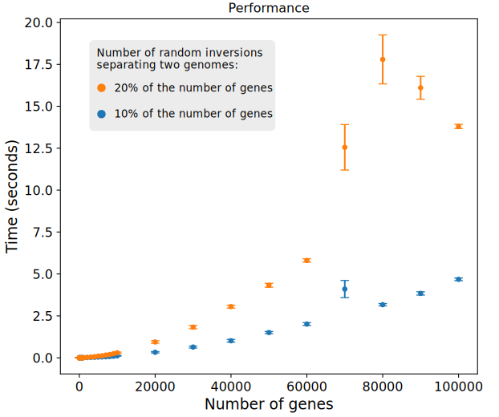

# Sorting by Reversals

## Overview

Given the order and the orientation of a set of genes in two genomes, the program finds an evolutionary path that connects both genomes with the minimum number of inversions. This path consists of a series of inversions that, when applied to one genome, will transform it into the other.

It is expected that many different evolutionary paths, possibly composed of different inversions, could explain the differences observed in two genomes. The program finds one of these possible minimum sequence of inversions. You can change the chosen solution by modifying the randomness of the program via the *seed* parameter, which is explained later.

This problem is known in the literature as **Sorting by Reversals**. Further information on program usage, performance, and algorithm details is provided below.

## Usage

Two options are available to test the implementation: 

1. a program that runs on a set of small examples taken from literature; 
2. a program that generates random signed permutations, either completely independent or constrained to be separated by a given number of inversions. 

Here we focus on the usage of the latter. Information about the former is available in the header of [tests_VariousPapers.cpp](https://github.com/pribiller/revsort/blob/main/tests_VariousPapers.cpp).

### Use case: Random permutations

#### Compile
```
g++ tests_RandomPermutations.cpp sortByReversals.cpp findComponents_Bader2001.cpp sortOrientedByReversals_Tannier2007.cpp solveUnoriented_HannenhalliPevzner1999.cpp genome.cpp -o revsort_random
```

#### Run
```
./revsort_random [seed] [genes] [reversals] [tests] [verbose]
```

#### Example
```
./revsort_random 42 10 4 3 2
```

#### Parameters
All parameters are mandatory and must be given in the following order:
1. **seed**: any positive integer greater than 0. This value is used by the random number generator to produce random values. It ensures that tests are reproducible: If you use the same number as a seed in two different runs, you are going to obtain the same results;
2. **genes**: the number of genes. In the example above, all random genomes will have 1 chromosome (for now all genomes are unichromosomal) and 10 genes;
3. **reversals**: the number of reversals separating two genomes. If this value is equal to 0, two random independent permutations will be created. If this value is greater than 0, the second genome is obtained from the first genome by applying the specified number of random reversals. In the example above, all pairs of random genomes will be separated by 4 reversals. Notice that, if the number of reversals is too high, the reversal distance (minimum number of reversals that separates two genomes) will be lower than the actual number of reversals;
4. **tests**: the number of tests. Each test will create a pair of random genomes and sort them. In the example above, 3 scenarios will be randomly generated and solved;
5. **verbose**: a number between 0 and 4 that controls the verbosity level for the output messages:
   - **verbose=0** (for cluster): only basic stats are printed;
   - **verbose=1** (for user): basic messages are printed;
   - **verbose=2** (for user): basic messages + replay of the sorting scenario (not recommended if the genome is too big);
   - **verbose=3** (for developer): very detailed messages, useful for debugging.

## Performance

The main algorithm implemented in this program comes from the paper ["Advances on sorting by reversals"](https://www.sciencedirect.com/science/article/pii/S0166218X06003751) by Eric Tannier, Anne Bergeron, and Marie-France Sagot.

This paper proposes an algorithm with subquadratic time complexity to sort a genome. Given two genomes with *n* genes, the program can find a sequence of reversals in O(*n*×√(*n*×log(*n*)). Until very recently (2024), this was the fastest algorithm to solve the problem. 

> [!NOTE]
> Last year, two independent teams presented an O(*n*×log(*n*)) implementation, both inspired by Tannier's method. 
> If you want to know more about these recent developments, please check the papers from [Krister Swenson](https://arxiv.org/abs/2403.20165) and [Bartłomiej Dudek et al.](https://epubs.siam.org/doi/abs/10.1137/1.9781611977936.19).

Here we test the algorithm's implementation with random unichromosomal genomes of different sizes. The size of the genome, defined by the number of genes (*n*), varies from very small genomes with 10 genes to very large genomes with 100,000 genes.
Each genome size was tested 100 times, and the results below show the average time taken and the standard deviation. 
The algorithm typically runs in a few seconds for most sizes, staying under a minute for genomes with thousands of genes. Even in the worst-case scenario of 100,000 genes, the algorithm provides a solution in about 2 minutes.



## How the actual number of inversions affects different attributes

In this second test, we fix the number of genes at **1,000 genes** and we vary the number of inversions separating the two genomes. The number of inversions, expressed as a percentage of the total number of genes, ranges from 1% (10 inversions) to 100% (1,000 inversions), increasing in increments of 1% (10 inversions), 2% (20 inversions), and so on.

In the plot below, we compare the actual number of inversions separating the two genomes with the average number of inversions found in our solution. The number of inversions in the solutions correspond to the *reversal distance*, which is the minimum number of inversions required to explain the observed differences between two genomes. We can see that as the number of inversions becomes too high, the reversal distance underestimates the actual number of inversions.


In the next plot we check how performance is influenced by the number of inversions. Every reversal needed to sort one genome into another requires an extra iteration of the method. As the number of inversions increases, so do the iterations, affecting the running time until it reaches the maximum possible distance, which is limited by the genome size, where the time plateaus and stops increasing.


## Algorithm details


## References

